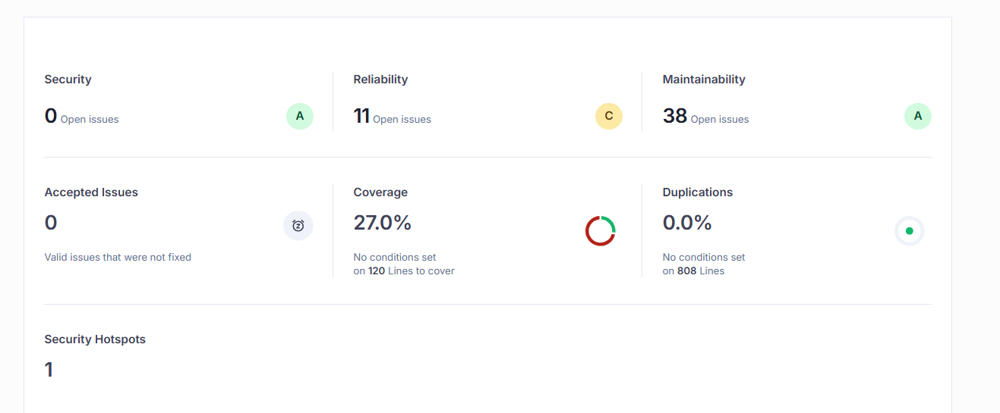
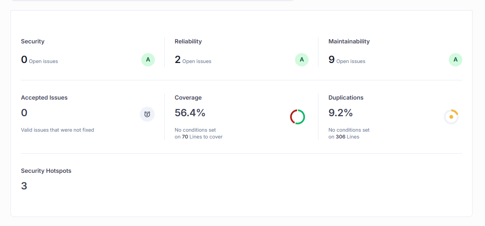
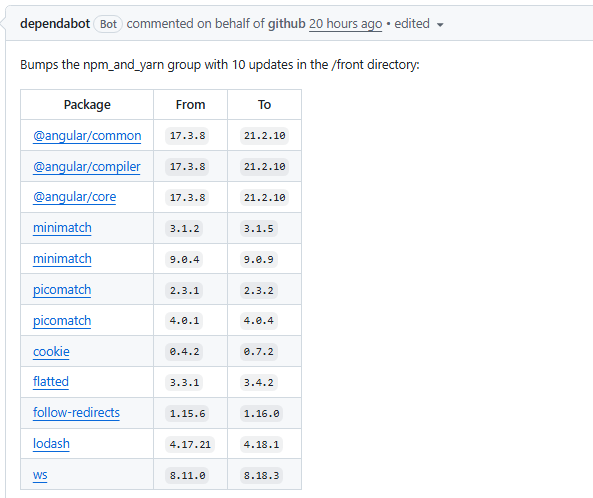
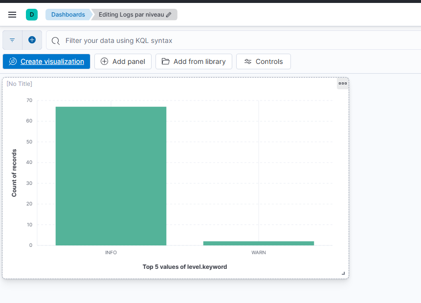

# Documentation Technique MicroCRM

| | |
|---|---|
| **Auteur** | Bastien Esquiros |
| **Option choisie** | Option B (Scénario Orion) |
| **Date** | 25/04/2026 |

---

## Table des matières

1. [Introduction](#1-introduction)
   - 1.1 [Contexte du projet](#11-contexte-du-projet)
   - 1.2 [Objectifs de l'industrialisation](#12-objectifs-de-lindustrialisation)
   - 1.3 [Technologies principales](#13-technologies-principales)
   - 1.4 [Présentation rapide du pipeline CI/CD](#14-présentation-rapide-du-pipeline-cicd)
2. [Étapes de mise en œuvre du pipeline CI/CD](#2-étapes-de-mise-en-œuvre-du-pipeline-cicd)
   - 2.1 [Structure du pipeline](#21-structure-du-pipeline)
   - 2.2 [Scripts d'automatisation](#22-scripts-dautomatisation)
   - 2.3 [Reproductibilité](#23-reproductibilité)
3. [Plan de conteneurisation et de déploiement](#3-plan-de-conteneurisation-et-de-déploiement)
   - 3.1 [Dockerfiles](#31-dockerfiles)
   - 3.2 [docker-compose.yml](#32-docker-composeyml)
4. [Plan de testing périodique](#4-plan-de-testing-périodique)
   - 4.1 [Types de tests automatisés](#41-types-de-tests-automatisés)
   - 4.2 [Fréquence d'exécution](#42-fréquence-dexécution)
   - 4.3 [Objectifs des tests](#43-objectifs-des-tests)
5. [Plan de sécurité](#5-plan-de-sécurité)
   - 5.1 [Résultats SonarQube](#51-résultats-sonarqube)
   - 5.2 [Analyse des risques](#52-analyse-des-risques)
   - 5.3 [Plan d'action / Remédiation](#53-plan-daction--remédiation)
6. [Monitoring, métriques & KPI](#6-monitoring-métriques--kpi)
   - 6.1 [Métriques DORA](#61-métriques-dora)
   - 6.2 [KPI personnalisés](#62-kpi-personnalisés)
   - 6.3 [Analyse synthétique du monitoring](#63-analyse-synthétique-du-monitoring)
7. [Plan de sauvegarde des données](#7-plan-de-sauvegarde-des-données)
   - 7.1 [Ce qui doit être sauvegardé](#71-ce-qui-doit-être-sauvegardé)
   - 7.2 [Procédure de sauvegarde](#72-procédure-de-sauvegarde)
   - 7.3 [Procédure de restauration](#73-procédure-de-restauration)
8. [Plan de mise à jour](#8-plan-de-mise-à-jour)
   - 8.1 [Mise à jour de l'application](#81-mise-à-jour-de-lapplication)
   - 8.2 [Mise à jour du pipeline CI/CD](#82-mise-à-jour-du-pipeline-cicd)
   - 8.3 [Fréquence & bonnes pratiques](#83-fréquence--bonnes-pratiques)
9. [Conclusion](#9-conclusion)

---

## 1. Introduction

### 1.1 Contexte du projet

MicroCRM est une application web de type CRM léger (Customer Relationship Management) développée par et pour l'entreprise Orion, spécialisée dans les solutions techniques innovantes.

Cette application permet de gérer efficacement des contacts liés à des entreprises. Elle est composée d'un back-end **Spring Boot** exposant une API REST et d'un front-end **SPA Angular** consommant cette API.

### 1.2 Objectifs de l'industrialisation

L'industrialisation d'un projet est une étape clé consistant à standardiser des processus fiables et reproductibles afin de maîtriser la dette technique et soutenir la productivité sur le long terme.

Dans un but de respect de cet objectif pour MicroCRM, nous avons mis en place un pipeline CI/CD permettant de :

- Automatiser le build et l'exécution des tests, garantissant l'intégrité du projet à chaque modification
- Assurer la qualité et la sécurité du code via **SonarCloud**, en détectant notamment les anomalies et les mauvaises pratiques
- Automatiser la génération de versions pour faciliter la traçabilité et le déploiement

Nous avons également intégré des pratiques standardisées d'exploitation :

- La **conteneurisation via Docker**, garantissant l'isolation des services, la cohérence des environnements et la reproductibilité des déploiements
- Une **stack d'observabilité basée sur ELK** (Elasticsearch, Logstash, Kibana), permettant la centralisation, l'analyse et la visualisation des logs applicatifs

### 1.3 Technologies principales

| Composant | Technologie |
|---|---|
| Back-end | Spring Boot |
| Front-end | Angular |
| Conteneurisation | Docker / Docker Compose |
| CI/CD | GitHub Actions |
| Qualité / Sécurité | SonarCloud |
| Monitoring logs | ELK (Elasticsearch, Logstash, Kibana) |

### 1.4 Présentation rapide du pipeline CI/CD

Le pipeline est organisé en deux workflows GitHub Actions :

- **`ci.yml`** : déclenché sur chaque push ou pull request vers `main`. Il build et teste le back-end (Gradle + JUnit) et le front-end (Angular + Karma/Jasmine), puis envoie les résultats à SonarCloud pour analyse qualité.
- **`release.yml`** : déclenché par la pose d'un tag SemVer (`vX.Y.Z`). Il produit les artefacts (JAR + bundle Angular), crée une GitHub Release et publie les images Docker sur GHCR.

---

## 2. Étapes de mise en œuvre du pipeline CI/CD

### 2.1 Structure du pipeline

**CI (`ci.yml`) – sur push / pull request vers `main` :**

```
checkout
├── [back-ci]
│     ├── Setup JDK 17 (Temurin)
│     ├── Cache Gradle
│     ├── chmod +x gradlew
│     ├── ./gradlew build  (compile + tests + JaCoCo)
│     ├── ./gradlew sonar  (analyse SonarCloud)
│     └── Upload JAR artifact
│
└── [front-ci]
      ├── Setup Node 18
      ├── npm ci
      ├── npm run test:ci  (Karma headless + coverage lcov)
      ├── sonarqube-scan-action@v6  (analyse SonarCloud)
      ├── npm run build --configuration production
      └── Upload dist artifact
```

**Release (`release.yml`) – sur tag `vX.Y.Z` :**

```
tag poussé
├── [build-back]  →  gradlew build  →  upload JAR
├── [build-front] →  npm build      →  upload zip
├── [release]     →  GitHub Release + artefacts attachés
└── [docker]      →  build & push images GHCR (back + front)
```

**Justification des actions GitHub choisies :**

| Action | Justification |
|---|---|
| `actions/checkout@v4` | Action officielle GitHub, maintenue |
| `actions/setup-java@v4` | Support Temurin, cache intégré |
| `actions/setup-node@v4` | Cache npm intégré, officielle |
| `actions/cache@v4` | Cache Gradle pour accélérer les builds |
| `actions/upload-artifact@v4` | Partage d'artefacts entre jobs |
| `actions/download-artifact@v4` | Récupération des artefacts en release |
| `dorny/test-reporter@v1` | Publie les rapports JUnit XML sous forme de GitHub Checks, visibles dans les PRs |
| `SonarSource/sonarqube-scan-action@v6` | Action officielle Sonar |
| `softprops/action-gh-release@v2` | Standard communautaire pour créer des releases GitHub avec artefacts |
| `docker/build-push-action@v6` | Action officielle Docker pour GHCR |

### 2.2 Scripts d'automatisation

| Script / Commande | Fichier de définition | Rôle | Moment d'exécution |
|---|---|---|---|
| `./gradlew build` | `back/build.gradle` | Compile, teste, génère le JAR et le rapport JaCoCo | CI push/PR, Release |
| `./gradlew sonar` | `back/build.gradle` + workflow | Envoie les résultats à SonarCloud | CI push/PR |
| `npm ci` | `front/package.json` | Installe les dépendances exactes | CI, Release, local |
| `npm run test:ci` | `front/package.json` | Lance Karma en headless avec couverture lcov | CI push/PR |
| `npm run build -- --configuration production` | `front/package.json` | Produit le bundle Angular optimisé | CI push/PR, Release |
| `docker compose up -d` | `docker-compose.yml` | Lance back + front en local | Local |

### 2.3 Reproductibilité

**Relancer le pipeline CI :**

Tout push vers `main` ou ouverture d'une PR déclenche automatiquement `ci.yml`. Il est également possible de le relancer manuellement depuis l'onglet **Actions** de GitHub → CI → **Run workflow**.

**Déclencher une release :**

```bash
git tag v1.0.0
git push origin v1.0.0
```

**Gestion des secrets :**

Aucun secret n'est stocké en clair dans le code ou les workflows. Tous les secrets sont déclarés dans **GitHub → Settings → Secrets and variables → Actions** :

| Nom du secret | Usage |
|---|---|
| `SONAR_TOKEN` | Authentification auprès de SonarCloud |

---

## 3. Plan de conteneurisation et de déploiement

### 3.1 Dockerfiles

**`back/Dockerfile` (back-end Spring Boot)**

- Stage 1 – build : `gradle:8.7-jdk17-alpine`
- Stage 2 – runtime : `eclipse-temurin:17-jre-alpine`

Points notables :
- **Multi-stage build** : le stage de build contient Gradle et le JDK (image lourde) ; seul le JAR est copié dans le stage final qui n'embarque que le JRE. L'image finale est ainsi ~180 Mo au lieu de ~600 Mo.
- **`eclipse-temurin`** : distribution officielle OpenJDK maintenue par Adoptium (communauté Eclipse), recommandée comme alternative à `openjdk` qui n'est plus maintenu sur Docker Hub.
- Les tests sont exclus du build Docker (`-x test`) car ils sont exécutés dans la CI.

**`front/Dockerfile` (front-end Angular)**

- Stage 1 – build : `node:18-alpine`
- Stage 2 – serve : `caddy:2-alpine`

Points notables :
- **`node:18-alpine`** : image LTS officielle, minimale (alpine).
- **`caddy:2-alpine`** : serveur HTTP moderne, configuration simple, gère automatiquement `try_files` pour le routing Angular (SPA). Remplace nginx pour sa simplicité de config.
- Le build context est la racine du projet (pour accéder à `misc/docker/Caddyfile`).

### 3.2 docker-compose.yml

**Stack applicative (dev) :**

| Service | Image | Port exposé |
|---|---|---|
| `back` | build local `back/Dockerfile` | 8080 |
| `front` | build local `front/Dockerfile` | 80 |

---

## 4. Plan de testing périodique

### 4.1 Types de tests automatisés

**Back-end (Spring Boot / JUnit 5)**

| Type | Framework | Fichiers | Ce qui est testé |
|---|---|---|---|
| Test de contexte | Spring Boot Test | `MicroCRMApplicationTests` | Démarrage de l'application |
| Test d'intégration JPA | `@DataJpaTest` | `PersonRepositoryIntegrationTest` | Requêtes repository sur base H2 en mémoire |

**Front-end (Angular / Karma + Jasmine)**

| Type | Framework | Fichiers | Ce qui est testé |
|---|---|---|---|
| Tests unitaires | Jasmine / Karma | `*.spec.ts` | Composants, services Angular |

**Analyse statique / sécurité (SonarCloud)**

- Détection de vulnérabilités (OWASP)
- Code Smells
- Duplications
- Couverture de tests (via JaCoCo pour le back, lcov pour le front)

**Quand les tests sont-ils exécutés ?**

| Déclencheur | Tests back | Tests front | Sonar |
|---|---|---|---|
| Push sur `main` | ✅ | ✅ | ✅ |
| Pull Request vers `main` | ✅ | ✅ | ✅ |
| Tag `vX.Y.Z` (release) | ✅ | ✅ | ❌ |
| Local (`./gradlew build`, `npm run test:ci`) | ✅ | ✅ | ❌ |

**Critères de réussite :**

- ✅ Tous les tests JUnit passent (exit code 0 Gradle)
- ✅ Tous les tests Karma passent (exit code 0 Angular CLI)
- ✅ La Quality Gate SonarCloud est verte (pas de nouvelles vulnérabilités bloquantes)

### 4.2 Fréquence d'exécution

- **Sur chaque push vers `main`** : CI complète (build + tests + Sonar)
- **Sur chaque Pull Request vers `main`** : même pipeline, résultat visible dans la PR
- **Avant chaque release** : les jobs `build-back` et `build-front` re-exécutent les tests

### 4.3 Objectifs des tests

- **Qualité** : détecter les régressions et code smells dès le commit
- **Non-régression** : garantir que les nouvelles fonctionnalités ne cassent pas l'existant
- **Sécurité** : SonarCloud identifie les vulnérabilités connues (injection, exposition de données…)
- **Vérification avant déploiement** : le workflow `release` ne produit des artefacts que si le build réussit

---

## 5. Plan de sécurité

### 5.1 Résultats SonarQube

**Frontend :**



> ⚠️ Le score de « Reliability » est en **C**, et le « Coverage » est assez bas. Ces deux métriques sont les plus critiques à améliorer.

**Backend :**



> ⚠️ Le « Coverage » peut être amélioré. 10 % de « Duplications » est également un peu élevé. Le reste des métriques est acceptable, mais à surveiller.

### 5.2 Analyse des risques

La mise à jour des dépendances peut être facilitée par des outils comme **Dependabot**, qui soumet des Merge Requests de montée de versions.

Actuellement côté frontend, l'applicatif est sur une version d'Angular **qui n'est plus supportée** : si des vulnérabilités (CVE) sont détectées, elles ne seront pas traitées. Il est urgent de monter les versions — c'est le seul risque notoire actuel.



### 5.3 Plan d'action / Remédiation

**Actions immédiates (déjà mises en place)**

- Utiliser des images Docker officielles et minimales
- Stocker les secrets dans GitHub Secrets
- Activer SonarCloud sur le pipeline CI
- Mettre à jour `sonarqube-scan-action` vers v6 (vulnérabilité corrigée)
- Opt-in Node.js 24 pour les actions GitHub
- Activer Dependabot dans GitHub pour alertes de dépendances

**Actions à court terme**

- Traiter les issues SonarCloud après première analyse
- Scanner les images Docker avec Trivy ou similaire dans la CI

**Actions à long terme**

- Activer `xpack.security` sur Elasticsearch en production
- Mettre en place un WAF devant l'application
- Revue de sécurité trimestrielle des dépendances (audit)
- Veille active

---

## 6. Monitoring, métriques & KPI

### 6.1 Métriques DORA

> Les valeurs ci-dessous sont des estimations basées sur la configuration actuelle du projet. Des mesures réelles nécessitent un historique de déploiements.

| Métrique | Définition | Méthode de calcul | Valeur observée |
|---|---|---|---|
| Lead Time for Changes | Temps entre un commit et son déploiement en production | Date merge → date release GitHub | 2 semaines |
| Deployment Frequency | Fréquence des déploiements | Nombre de tags `vX.Y.Z` poussés par semaine | 2 semaines (hors MEP exceptionnelle ou environnement de qualif/recette) |
| MTTR (Mean Time To Restore) | Temps pour revenir à la normale après incident | Temps entre détection et nouvelle release stable | 1 heure |
| Change Failure Rate | % de déploiements ayant causé un incident | Releases en échec / total releases | 0 % |

### 6.2 KPI personnalisés

| KPI | Source | Valeur cible | Valeur observée |
|---|---|---|---|
| Temps de build back-end | GitHub Actions logs | < 3 min | 38 s |
| Temps de build front-end | GitHub Actions logs | < 2 min | 27 s |
| Temps total pipeline CI | GitHub Actions | < 6 min | 3 min 30 s |
| Taux d'erreurs dans les logs | Kibana (index `microcrm-*`) | < 1 % | 0 % *(dépend du taux de log applicatif)* |
| Couverture de tests back | SonarCloud / JaCoCo | 70 % | 56 % |
| Couverture de tests front | SonarCloud / lcov | 70 % | 27 % |

### 6.3 Analyse synthétique du monitoring

**Stack ELK**

Les logs du back-end Spring Boot sont envoyés en temps réel à Logstash, puis indexés dans Elasticsearch sous l'index `microcrm-YYYY.MM.dd`. Kibana permet de visualiser et filtrer ces logs via une Data View `microcrm-*`.

**Dashboards Disponibles :**



**Points forts :**
- Centralisation des logs applicatifs
- Recherche full-text dans Kibana
- Indexation automatique par jour

**Points à améliorer :**
- Ajouter des métriques applicatives via Micrometer / Spring Boot Actuator
- Configurer des alertes Kibana automatiques
- Création de dashboards plus riches, plus de logging applicatif

---

## 7. Plan de sauvegarde des données

### 7.1 Ce qui doit être sauvegardé

| Élément | Criticité | Raison |
|---|---|---|
| Code source (GitHub) | Haute | Versionné sur GitHub, résilient par nature |
| Artefacts de build (JAR, dist Angular) | Haute | Attachés aux GitHub Releases, conservés 7 jours en CI |
| Images Docker (GHCR) | Moyenne | Poussées à chaque release sur `ghcr.io` |
| Volume Elasticsearch (`es-data`) | Moyenne | Logs applicatifs – perte acceptable en dev |
| Fichiers de configuration | Haute | Versionnés dans le dépôt Git |
| Secrets GitHub | Haute | Versionnés sur GitHub |

### 7.2 Procédure de sauvegarde

**Artefacts de release**

Les artefacts (JAR + zip Angular) sont automatiquement attachés à chaque release GitHub. Ils sont accessibles depuis l'onglet **Releases** du dépôt.

```bash
# Lister les releases via GitHub CLI
gh release list

# Télécharger les artefacts d'une release
gh release download v1.0.0 --dir ./backup/v1.0.0
```

**Volume Elasticsearch (logs)**

```bash
# Snapshot manuel du volume Docker
docker run --rm \
  -v project_7_es-data:/data \
  -v $(pwd)/backup:/backup \
  alpine tar czf /backup/es-data-$(date +%Y%m%d).tar.gz /data
```

> Fréquence recommandée : hebdomadaire en dev, quotidienne en production.

**Secrets**

Sécuriser les secrets dans un vault ou un gestionnaire crypté.

### 7.3 Procédure de restauration

**Scénario : rollback vers une release précédente**

```bash
# 1. Identifier la version stable précédente
gh release list

# 2. Télécharger les images Docker de cette version
docker pull ghcr.io/bastienesquiros/oc_project_7/back:v1.0.0
docker pull ghcr.io/bastienesquiros/oc_project_7/front:v1.0.0

# 3. Mettre à jour docker-compose pour pointer sur cette version
# (modifier les tags dans docker-compose.yml)

# 4. Relancer
docker compose up -d
```

**Scénario : restauration du volume Elasticsearch**

```bash
docker compose down
docker run --rm \
  -v project_7_es-data:/data \
  -v $(pwd)/backup:/backup \
  alpine sh -c "cd / && tar xzf /backup/es-data-YYYYMMDD.tar.gz"
docker compose up -d
```

> ⚠️ **Limitation** : La base de données applicative est en mémoire (H2 in-memory) — toutes les données sont perdues à chaque redémarrage.

---

## 8. Plan de mise à jour

### 8.1 Mise à jour de l'application

**Dépendances Maven (back-end)**

```bash
cd back && ./gradlew dependencyUpdates
```

**Dépendances npm (front-end)**

```bash
cd front && npm outdated
npm update
# ou pour les majors :
npx ng update
```

**Images Docker**

Vérifier régulièrement les nouvelles versions sur Docker Hub.

### 8.2 Mise à jour du pipeline CI/CD

**Versions des actions GitHub** : à vérifier trimestriellement sur GitHub Marketplace.

### 8.3 Fréquence & bonnes pratiques

- **Mensuel** : vérifier les alertes Dependabot
- **Trimestriel** : revue des versions des actions GitHub et images Docker
- **À chaque release Spring Boot / Angular** : mettre à jour et tester en branche avant merge
- ❌ Ne jamais utiliser `:latest` comme tag d'image en production
- ✅ Toujours vérifier que la Quality Gate SonarCloud reste verte après une mise à jour

---

## 9. Conclusion

### Résumé des améliorations apportées

Ce projet met en place une chaîne DevOps complète pour une application Spring Boot + Angular :

- **CI automatisée** : chaque commit sur `main` déclenche build, tests et analyse SonarCloud
- **Conteneurisation** : images Docker légères et sécurisées (multi-stage, images officielles minimales)
- **Orchestration locale** : `docker compose up` suffit pour lancer l'application complète
- **Monitoring** : stack ELK pour la centralisation et la visualisation des logs applicatifs
- **Release automatisée** : création de releases GitHub versionnées (SemVer) avec artefacts et images Docker publiées sur GHCR

### Gains observés

| Axe | Avant | Après |
|---|---|---|
| Fiabilité | Build manuel, oublis possibles | Tests automatiques à chaque push |
| Rapidité | Déploiement manuel | Release en quelques minutes via un tag |
| Qualité | Aucune analyse statique | SonarCloud intégré, Quality Gate obligatoire |
| Observabilité | Logs locaux uniquement | Centralisation ELK, recherche full-text |

### Recommandations pour les prochaines itérations

- Migrer la base de données vers PostgreSQL ou MySQL pour la persistance
- Ajouter des tests end-to-end avec Cypress ou Playwright
- Déployer sur une plateforme cloud dans un environnement scalable (Kubernetes…)
- Mettre en place Prometheus + Grafana pour les métriques applicatives

---
